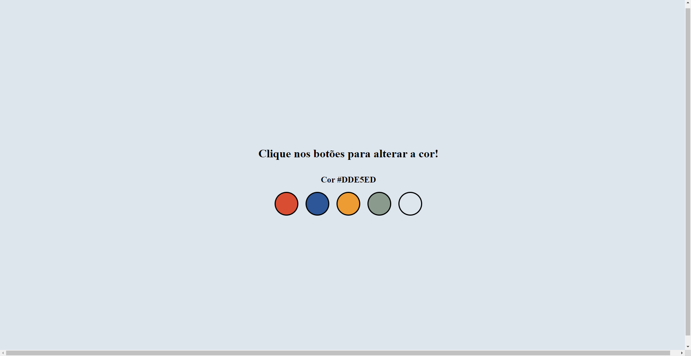
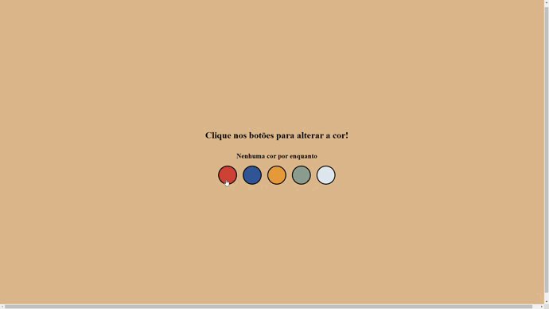

# Altera Fundo

</img>
</img>  

https://github.com/caiosss/alterar-fundo/assets/138716168/d40d5d93-5426-411d-94a1-2270b4902307

## 🤔 O que é esse projeto?
Este projeto é uma página feita com HTML, CSS Javascript que contém uma série de
botões cloridos para que a pessoa que está utilizando a aplicação possa alterar a
cor de fundo da página.

## 💻 Como rodar este projeto
Para rodar o projeto basta dar dois cliques no arquivo *index.html* uma  vez que a
pasta do projeto esteja aberta no sistema de arquivos do seu sistema oeperacional.

Alternativamente, você também pode utilizar a extensão *Live Server* da *IDE Visual
Studio Code* para rodar o projeto.

## 🕹️ Como usar este projeto
Uma vez que a aplicação esteja rodando, você pode clicar nos círculos coloridos
para alterar a cor de fundo da página. A cor será alterada de acordo com o 
botão que você pressionar.

## ⚙️ Tecnologias usadas no projeto
 
 
 

## 📒 Features do projeto
- 5 botões com cores diferente que alteram a cor de fundo da página.
- Subtítulo que é atualizado conforme a cor atual da página.

## 📁 Como este projeto está organizado
Na pasta raíz do projeto, existem três arquivos de código:
- index.html -> contém o html da aplicação.
- style.css -> contém o css da aplicação.
- script -> contém o código javascript da aplicação.

## 👨🏿‍💻 Como este projeto foi implementado
Este projeto foi implementado com HTML, CSS, Javascript.

No Javascript os botões definidos no HTML são capturados através de
um getElementByTagName e é adicionado um event listener a cada um desses
botões.

Ao clicar em um botão, é disparado um evento que irpa alterar a cor
de fundo da página e o título de segunda importância será atualizado
com o código da cor, que está armazenado em um array.

## 🌟 Dependências Principais
Não temos depêndecias no projeto.

## 💎 Links úteis
Não temos links úteis.

## 🤝 Como contribuir com o projeto
[Clique aqui](./CONTRIBUTING.md) para as diretrizes de contribuição

## 👨🏿‍💻 Pessoas que contribuiram com o projeto
- [Caio](github.com/caiosss) - mantedor do projeto.

## 🆘 Precisa de ajuda?
Você pode contatar o Caio (mantedor do projeto) em caiobarros1712@gmail.com ou entre em contato pelas redes sociais:

